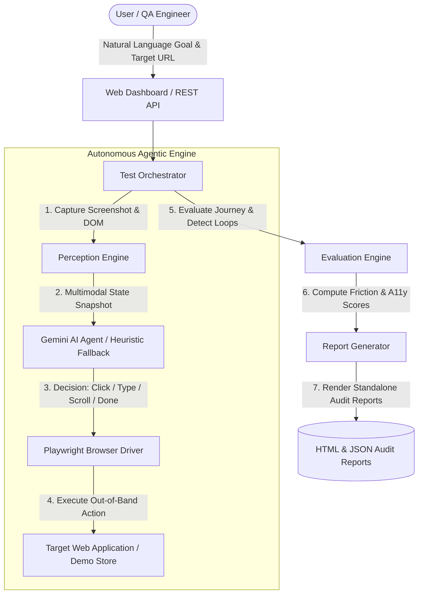

# Enterprise Autonomous UI/UX & Accessibility Testing Platform

An industry-grade, agentic black-box testing framework powered by **Playwright** and **Google Gemini (Multimodal)**. 
Give it a natural language goal and a URL, and it will autonomously explore, interact, validate, and report on your application.

## 🌟 Key Capabilities

1. **AI Test Planner**: Dynamically generates test cases (positive, negative, edge cases) based on a high-level intent.
2. **Autonomous Execution Engine**: Uses Gemini Multimodal AI to understand the screen and decide the next optimal interaction.
3. **Deep Accessibility Audit (axe-core)**: Autonomously scans every page visited for WCAG compliance.
4. **Visual Regression Engine**: Captures pixel-perfect screenshots and highlights unexpected layout drifts between runs.
5. **Self-Healing & Recovery**: Detects when an element is missing, an action fails, or a popup appears, and dynamically adjusts its strategy to recover.
6. **Network & Console Observability**: Hooks into the browser's lower levels to detect silent JS exceptions and failed API calls.
7. **Automated Bug Reporting**: Correlates errors, generates reproduction steps, suggests fixes, and files tickets directly to **GitHub Issues**.
8. **Session Replay (Time Travel)**: Records a comprehensive JSON log of every DOM state, screenshot, and action for debugging.

## 🌟 Key Features

- **Multimodal AI Reasoning**: Leverages Google Gemini (`gemini-3.7-flash` / `gemini-2.5-flash`) to visually analyze page screenshots alongside structured DOM interactive element snapshots to decide optimal next actions.
- **Hybrid Dual Engine**: Features a smart fallback heuristic decision engine that allows reliable offline operation and deterministic execution even without an active API key.
- **Black-Box Browser Automation**: Built on Playwright to execute out-of-band mouse clicks, text typing, keyboard interaction, scrolling, and navigation without modifying or invading target codebase source code.
- **Automated Accessibility (A11y) Audit**: Real-time detection of unlabeled buttons, missing input labels, icon-only controls, and keyboard accessibility flaws during navigation.
- **Quantitative UX Friction Scoring**: Transparent heuristic model evaluating user effort (0–100 score) penalizing excess steps, action failures, repeated clicks, cyclic navigation loops, and backtracks.
- **Standalone Executive HTML Reports**: Renders self-contained dark-mode audit reports complete with step-by-step reasoning timelines, screenshot thumbnails, severity ratings, and actionable UI recommendations.
- **Live Interactive Dashboard**: Web UI for monitoring real-time agent perception feeds, action logs, screenshot previews, intent templates, and run history.
- **Built-in Demo E-Commerce Store**: Includes an integrated mock store (`/demo`) for instant out-of-the-box testing and verification.

---

## 🏗 System Architecture



---

## 📁 Repository Structure

```
Autonomous-UI-UX-Testing-Agent/
├── backend/                  # Python FastAPI Backend Engine
│   ├── main.py               # REST API Server & static mount endpoints
│   ├── orchestrator.py       # Master controller managing test lifecycles
│   ├── perception.py         # DOM extraction & state hashing engine
│   ├── agent.py              # Gemini multimodal AI & heuristic decision engine
│   ├── driver.py             # Playwright async browser automation driver
│   ├── evaluator.py          # Journey friction calculator & loop detector
│   ├── report.py             # HTML & JSON report rendering engine
│   ├── schemas.py            # Pydantic data models & enums
│   └── config.py             # Central environment configuration settings
├── frontend/                 # Web Dashboard UI
│   ├── index.html            # Main dashboard HTML template
│   ├── style.css             # Dark-mode styling system
│   └── app.js                # Real-time state polling & frontend logic
├── demo_app/                 # Embedded Demo E-Commerce Store
│   ├── index.html            # Mock shoe store UI
│   ├── style.css             # Product grid & cart styles
│   └── store.js              # Interactive store behavior & popups
├── tests/                    # Automated Test Suite (pytest)
│   ├── test_api.py           # API endpoint integration tests
│   ├── test_driver.py        # Driver automation tests
│   ├── test_evaluator.py     # Evaluation & scoring unit tests
│   ├── test_orchestrator.py  # End-to-end orchestration tests
│   ├── test_report.py        # Report generation unit tests
│   └── test_schemas.py       # Schema validation unit tests
├── reports/                  # Generated HTML & JSON Audit Reports
├── runs/                     # Saved test run logs & state history
├── screenshots/              # Step-by-step perception screenshots
├── .env.example              # Environment variables template
├── pytest.ini                # Pytest configuration file
├── requirements.txt          # Python dependencies
└── README.md                 # Project documentation
```

---

## 🚀 Getting Started

### Prerequisites

- **Python**: Version `3.10` or higher
- **Node.js / Chromium**: Required for Playwright browser execution

### 1. Clone the Repository

```bash
git clone <your-repo>
cd Autonomous-UI-UX-Testing-Agent

# Install dependencies
python -m pip install -r requirements.txt

# Install Playwright browsers
playwright install chromium --with-deps
```

### 2. Configuration

Copy `.env.example` to `.env`:
```bash
cp .env.example .env
```
Add your `GEMINI_API_KEY` inside `.env`.

### 3. Run the Dashboard

```bash
python -m backend.main
```
Open `http://127.0.0.1:8000` in your browser.

### 4. CI/CD Command Line Interface

You can run the engine headlessly in GitHub Actions or any CI/CD pipeline:
```bash
python -m backend.cli "Add blue running shoe to cart and checkout" "http://localhost:8000/demo/store.html" \
  --mode goal_directed \
  --device desktop \
  --headless \
  --file-bugs \
  --fail-on-bug
```

## 🏗 Architecture Overview

The system is broken down into highly specialized modular engines:

- `orchestrator.py`: The central coordinator managing the testing lifecycle.
- `agent.py`: Multimodal AI Agent driving the interaction.
- `planner.py`: Goal translation and structured test case generation.
- `observability.py`: Passive telemetry gathering (Network/Console).
- `visual.py`: Pixel-diffing and layout drift detection.
- `accessibility.py`: WCAG compliance validation.
- `bug_detector.py`: Heuristically correlates findings to generate rich bug reports.
- `recovery.py`: Self-healing strategies for broken locators and modals.
- `github_integration.py`: Connects findings directly to issue trackers.

## 🧪 Included Demo Application

A built-in demo e-commerce app is included for testing the capabilities of the agent. It contains intentional visual drift, accessibility violations, and network/console errors.
Access it at: `http://127.0.0.1:8000/demo/store.html`

## 📄 License

MIT License
